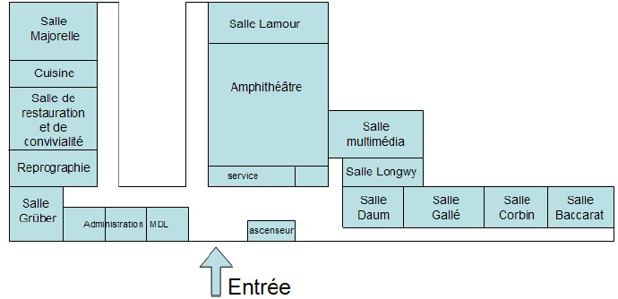

# La M2L
__LA MAISON DES LIGUES__

__UNE LIGUE AU SERVICE DU SPORT__

- SOMMAIRE
  - [PRESENTATION](#presentation)
  - [INFOS PRATIQUES](#infos-pratiques)
  - [ANNUAIRE DES LIGUES](#annuaire-des-ligues)
  - [LES CHAMPIONS DE LA M2L](#les-champions-de-la-m2l)
## presentation
La M2L est une ligue regroupant toutes les disciplines sportives des jeux olympiques et paralympiques représentées par les athlètes de la région

- DISCIPLINES SPORTIVES REPRESENTEES

  - 🤾🏾‍♂️: handball
​
  - ⛹🏾: basket

  - ​🏊🏾: nage

  - ​🚣🏾: kayak

  - ​🏄🏾: surf

  - ​🏌🏾: golf

  - ​ 🏂🏾: ski

  - ​🏇🏾: equitation

  - ​🧗🏾‍♀️: escalade

  - ​🏃🏾‍♂️‍➡️: course a pied

  - ​👩🏾‍🦽‍➡️: parasport
## infos pratiques
La ligue est hébergée dans des locaux équipés de matériel ultra performants

## annuaire des ligues
Elle est constituée d'adhérents et de membres honoraires qui peuvent être contactés à notre permanence.
- ☎️
## les champions de la M2L
Les champions de la ligue comptent nombres d'athlètes lorrains médaillés aux jeux olympiques et paralympiques.
- 🏅
- 🥇
- 🥈
- 🥉